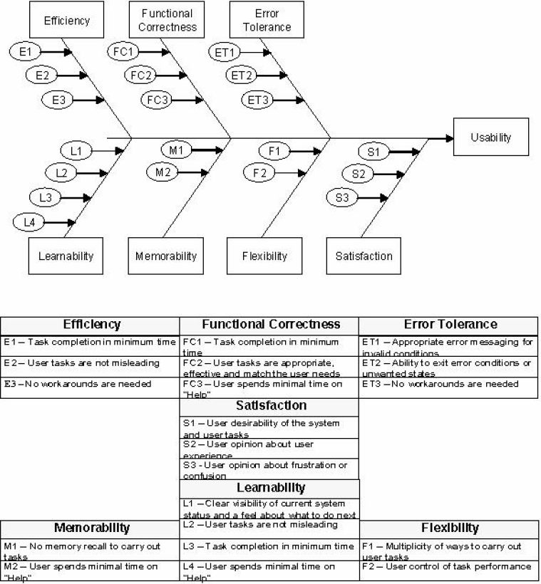

## Today's Tasks
- How can the "User Experience" afforded by an HMI/SCADA application be quantified?
- What questions should survey participants provide answers too?
<!-- truncate -->
### Question - How can UX be quantified?

#### Reading

- [User Experience in HMI: An Enhanced
  Assessment Model](https://researchsystem.canberra.edu.au/ws/portalfiles/portal/29187361/full_text_published.pdf)
- [User and Usability Modeling for HCI/HMI: A Research Design](https://ieeexplore-ieee-org.salford.idm.oclc.org/document/4250189)
- [Human-computer interaction: The usability test methods and design principles in the human-computer interface design](https://ieeexplore-ieee-org.salford.idm.oclc.org/document/5234724)
- [Research on Evaluation System of Human-Computer Interaction Interface for Spacecraft Complex Information System](https://ieeexplore-ieee-org.salford.idm.oclc.org/document/10823892)
- 

#### Conclusion

Table I in "User Experience In HMI" provides a good reference to the sorts of UX Assessment criteria required.

### Evaluation of a Control Screen

The following questions are rated 1 to 5, i.e. strongly dis-agree to strongly agree. All questions are regarding your
user experience provided by the control screen.

**1. Satisfaction**

| Question                               | 1 | 2 | 3 | 4 | 5 |
|----------------------------------------|---|---|---|---|---|
| a. It's visually appealing             |   |   |   |   |   |
| b. It's a pleasure interaction with    |   |   |   |   |   |
| c. It meets my expectations            |   |   |   |   |   |
| d. It's frustrating                    |   |   |   |   |   |
| e. Terminology is confusing            |   |   |   |   |   |
| f. The overall user experience is poor |   |   |   |   |   |

---

| ~~~~~~~~~~~~~~ Comment on Satisfaction (optional) ~~~~~~~~~~~~~~~~~~~~ |
|------------------------------------------------------------------------| 
|                                                                        |
|                                                                        |
|                                                                        |
|                                                                        |
|                                                                        |
|                                                                        |
|                                                                        |
|                                                                        |

___

**2. Functional Correctness**

| Question                                            | 1 | 2 | 3 | 4 | 5 |
|-----------------------------------------------------|---|---|---|---|---|
| a. All commands complete correctly                  |   |   |   |   |   |
| b. All your needs, from a control screen, are met   |   |   |   |   |   |
| c. All information is available for decision making |   |   |   |   |   |

---

**3. Efficiency**

| Question                                       | 1 | 2 | 3 | 4 | 5 |
|------------------------------------------------|---|---|---|---|---|
| a. Tasks can be completed quickly;             |   |   |   |   |   |
| b. Completed task achieve the expected outcome |   |   |   |   |   |
| c. Tasks are completed easily                  |   |   |   |   |   |

---

**4. Error Tolerance**

| Question                                              | 1 | 2 | 3 | 4 | 5 |
|-------------------------------------------------------|---|---|---|---|---|
| a. There are few errors                               |   |   |   |   |   |
| b. Error conditions are clearly visible               |   |   |   |   |   |
| c. Error messages inform of corrective action to take |   |   |   |   |   |

---

**5. Memorability**

| Question                                  | 1 | 2 | 3 | 4 | 5 |
|-------------------------------------------|---|---|---|---|---|
| a. It's easy to remember task steps       |   |   |   |   |   |
| b. Task steps need to be memorised        |   |   |   |   |   | 
| c. Help documents are frequently accessed |   |   |   |   |   |

---

**6. Flexibility**

| Question                                                   | 1 | 2 | 3 | 4 | 5 |
|------------------------------------------------------------|---|---|---|---|---|
| a. There are alternate ways of performing the same task    |   |   |   |   |   |
| b. Navigation between different tasks is easy              |   |   |   |   |   |
| c. It's easy to cancel a task before commiting to the task |   |   |   |   |   |

---

**7. Learnability**

| Question                           | 1 | 2 | 3 | 4 | 5 |
|------------------------------------|---|---|---|---|---|
| It's easy to learn how to operate  |   |   |   |   |   |
| System status is clearly displayed |   |   |   |   |   |
| It's easy to know what to do next  |   |   |   |   |   |

---

**8. Safety**

| Question                                                   | 1 | 2 | 3 | 4 | 5 |
|------------------------------------------------------------|---|---|---|---|---|
| a. There are few keystrokes or clicks in performing a task |   |   |   |   |   |
| b. Your personal data, if any, is protected                |   |   |   |   |   |
| c. There is adequate cybersecurity.                        |   |   |   |   |   |

---

@20:15 
- Participant Information Form, Participant consent and Questionnaire, signed and submitted :crossed_fingers: