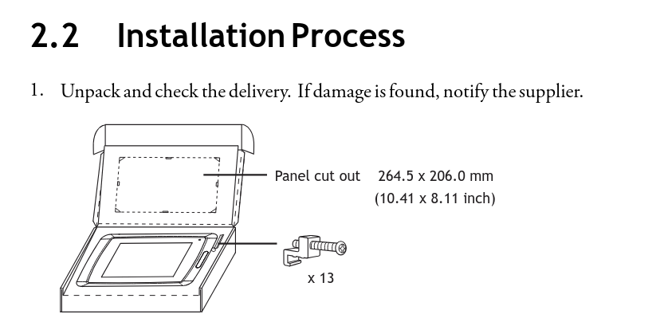
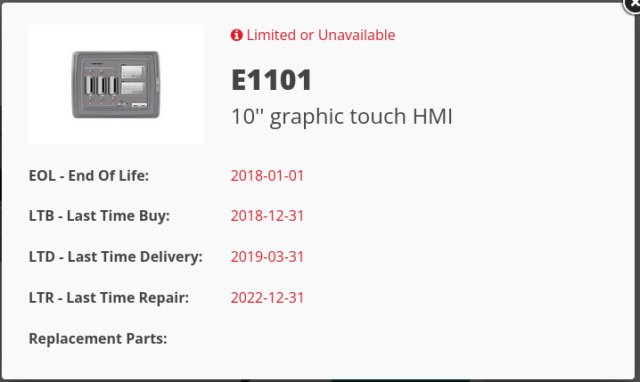
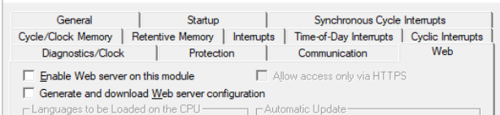

## Today's Tasks
- Will the existing panel cut-off need resizing for the new HMI?
- Start investigating HMI tags - Starting with Alarm tags
- Ready Step 7 Classic project for migration
<!-- truncate -->
## Question - What are the dimensions of the existing HMI panel cut-out?

### Beijer E1101 - Panel Cut-out



Figure: 1, Beijer E1101 Panel cut-out dimensions<sup>[1](#references)</sup>

---

### Beijer E1101 - Product Lifecycle



Figure 2: The Beijer E1101 Product Life Cycle<sup>[2](#references)</sup>

---

## Investigation - Existing Alarm Tags

### Findings
- HMI project alarm messages do not match the SCADA alarm messages. Believe the SCADA data is more trustworthy.
- There are a number of 16-bit io-integers which are programmatically mapped to discrete alarm bits.
- [Need to develop a python script to convert WW Intouch discrete bits to ignition alarm tags](https://github.com/orgs/pfAuto/projects/15/views/1?pane=issue&itemId=131779847&issue=pfAuto%7Cproject-uni%7C5). AlarmTags.csv saved in project-uni/hmi/


## Ready S7 Classic Project for Migration.

### Method

Follow the steps in the Siemens article [What are the requirements for migrating a STEP 7 V5.x project to TIA Portal](https://www.industry-mobile-support.siemens-info.com/en/article/detail/62100731)


#### Results of NetPro Consistency Check
_No Errors_

#### Results of Hardware Config Consistency Check
_No Errors_

#### Results of Block Consistency Check
_No Errors, 1 Warning_

```text
1: FC250 [SCL] ...
4 sec
Warning: The source, from which the block was created cannot, be found.

```
:::info
Note: FC250 "REAL TO TIME" an SCL block without its source will be "Know-how" protected after migration - see section 7
of the above article.
:::

:::warning
In process of migrated to Classic V5.7.2.0 received the following message from the Hardware Consistency Check
:::

```text

================================ 02.10.2025 08:58:17 ================================
Consistency Check (256:38):	Illegal access to write-protected  attribute 112412.
Consistency Check (13:5945):	No CPU password is assigned. Assign a password or reduce the CPU protection level.
Consistency Check (1230:5067):	The CiR download capability cannot be guaranteed. A one-off download via Stop is 
necessary to restore the CiR download capability.
```

#### Question - What needs to be done to resolve the above issue.
Since this is a migration process and security will be improved in TIA, the CPU protection level will be 
reduced in the S7 Classic project. That's done and No errors from the consistency check.

### CPU Web Server - Is it enabled? - No!


### Clock byte

Is configure as MB0

### What's next?

Read and follow instructions in the appropriate articles in [PLC Migration to S7-1500 with TIA Portal](https://www.industry-mobile-support.siemens-info.com/en/article/detail/67858106)

#### References
1. [Biejer Electronics - E1101 Installation Manual](https://www.google.com/url?sa=t&source=web&rct=j&opi=89978449&url=https://www05.beijerelectronics.com/API/SharePointFileByKnowledgeBaseIdAndIndex/8CBA8AB1C827401FAD82461688015C68/53&ved=2ahUKEwid7LXIv4WQAxWEVEEAHUuwC5gQFnoECAsQAQ&usg=AOvVaw0Kut3Wg7Cals0oTbdHGPaH)
2. [Biejer Electronics - E1101 Panel](https://www.beijerelectronics.com/Products/Operator___panels/Previous___models/E1000/E1000/E1101)