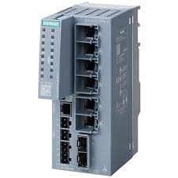
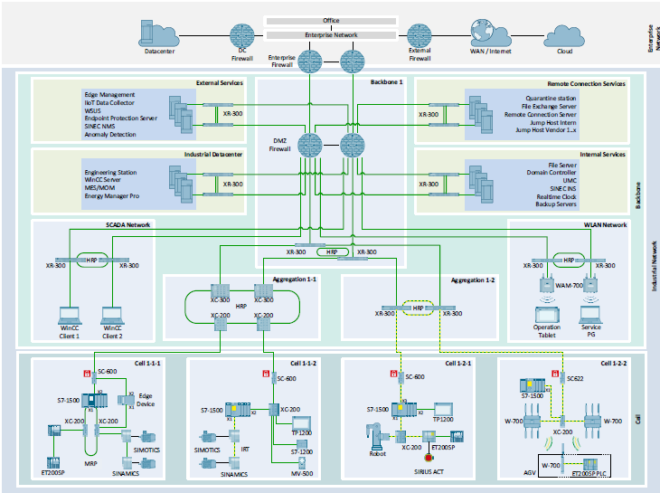
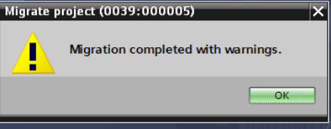

## Today's Tasks
1. [Make note of connections in NetPro](https://github.com/orgs/pfAuto/projects/15/views/1?pane=issue&itemId=131833038&issue=pfAuto%7Cproject-uni%7C11) ✅
1. [Could firewalls be employed to improve security](https://github.com/orgs/pfAuto/projects/15/views/1?pane=issue&itemId=131869530&issue=pfAuto%7Cproject-uni%7C14)
2. [Ready PLC Project for Migration](https://github.com/pfAuto/project-uni/issues/2)
<!-- truncate -->

## NetPro Connections

Detailed in [repo issue 11 - mfa required](https://github.com/pfAuto/project-uni/issues/11).

## Security in OT Networks

### Meet the Siemens Scalance SC-600



1. [SCALANCE SC-600 CLI V3.1](https://support.industry.siemens.com/cs/attachments/109988555/PH_SCALANCE-SC-600-CLI_76_en-US.pdf)
2. [SCALANCE SC-600 - Declaration of conformity to IEC 62443-4-2](https://support.industry.siemens.com/cs/attachments/109962987/PI_SCALANCE-SC-600_IEC62443_76.pdf)
3. [Industrial Ethernet security SCALANCE SC-600](https://support.industry.siemens.com/cs/attachments/109954238/BA_SCALANCE-SC-600_76_en-US.pdf)
4. [Understanding and Using Firewall of Industrial Security Appliance SCALANCE S](https://support.industry.siemens.com/cs/document/22376747/understanding-and-using-firewall-of-industrial-security-appliance-scalance-s?dti=0&lc=en-GB)

### Network Concepts



1. [Network concepts for Industrial Automation Networks](https://support.industry.siemens.com/cs/attachments/109802750/109802750_NetworkConcept_FA_V2.0_en.pdf)
2. [Central User Management with "User Management Component"(UMC)](https://support.industry.siemens.com/cs/document/109780337/central-user-management-with-user-management-component-(umc)-?dti=0&lc=en-GB)

#### Summary
In a word, YES. The article `Network concepts for Industrial Automation Networks` provided some perfect info and deserves re-reading!!
## Ready PLC project for migration



Not what I wanted to see... But, hey... Could be worse!!

### Unable to employ slice access?

**The Issue**
In FB169 Network 2,The address is not occupied by a tag.

```text
    T     %LW0    
```
In the block interface LW0 is part of a UDT typed variable. Therefore, been trying to use "slice" access, that is;

```text
    T varName.W0
```
However, the IDE is adding a % so the attempted symbolic address becomes absolute. Doh!

In researching the problem came across this [Difference between standard and optimized block access](https://support.industry.siemens.com/cs/document/67655611/difference-between-standard-and-optimized-block-access?dti=0&lc=en-GB)

Created an issue to [Change the S7-300 CPU to S7-1500](https://github.com/pfAuto/project-uni/issues/15), which is capable of employing "Optimized Blocks", unlike S7-300/400 CPU's

## For another day...

### Continuous Integration with TIA Portal


Application Example: [CI with TIA Portal](https://support.industry.siemens.com/cs/document/109801203/continuous-integration-with-tia-portal?dti=0&lc=en-GB)
