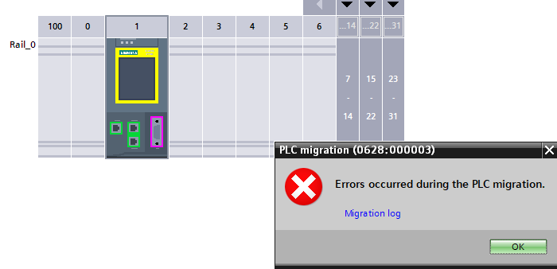

## Today's Tasks
1. [Change the S7-300 CPU to S7-1500 ](https://github.com/pfAuto/project-uni/issues/15)
<!-- truncate -->

### Changing the CPU to 1500


In the migration log there are;
- 18 Errors
  - The following blocks could not be migrated:,10/4/2025,11:46:58 AM,, - **types of issues are;**
    - The block is know-how protected.
    - Instance of the know-how protected block CONT_C_LF
    - OBNL_FLT (OB85): The OB is not supported on the target system.
    - COMM_FLT (OB87): The OB is not supported on the target system.,10/4/2025,11:46:58 AM,,
  - The block includes instructions which address hardware modules. Enter the hardware ID of the new modules. ,10/4/2025,11:50:42 AM,,
- 10 Warnings
  - The processing of the OBs has changed.,10/4/2025,11:50:42 AM,,
  - Writing an input parameter does not affect the PLC tag (I, Q, M, T, C) that is transferred as actual parameter.,10/4/2025,11:50:42 AM,,
  - The RLO is reset as a result of the BCD conversion.,10/4/2025,11:50:42 AM,,
- 95 Info's
  - The instruction 'DPWR_DAT' has been adapted.,10/4/2025,11:50:42 AM,,
  - All empty networks are removed.,10/4/2025,11:50:42 AM,,
  - If the instruction '---(SAVE)' has been used in the last network of a block, it is replaced by the instruction '---(RET)' with the parameter 'RLO'.,10/4/2025,11:50:42 AM,,
  - The outdated access to the status word was replaced by a comparator.,10/4/2025,11:50:42 AM,,
  - The instruction 'GET_S' is replaced by GET.,10/4/2025,11:50:42 AM,,
  - The instruction 'PUT_S' is replaced by PUT.,10/4/2025,11:50:42 AM,,

#### How to resolve the errors?

The TIA Information System provided the following info;

**Organization blocks are no longer supported**

The reference program contains organization blocks that are no longer supported on the target device. If the program 
contains unsupported organization blocks, you must reproduce their functionality in the S7-1500 CPU.


**The reference program contains know-how protected blocks**

A block may be know-how protected for the following reasons:
- Know-how protection was specified by the block creator. 
- If the program contains know-how protected blocks, remove the know-how protection from all blocks before migration, if possible, and restart the migration. 
- The know-how protected block is a library block from STEP 7 that is no longer supported in the TIA Portal. During migration into the TIA Portal, these blocks are provided with the name suffix "_LF" (legacy function). During PLC migration into an S7-1500 CPU, these blocks are not migrated.

If the program contains know-how protected blocks with the "_LF" name suffix, check prior to migration whether they can be replaced with an instruction from the "Instructions" task card. Then restart the migration.

### Question - Which Datablocks are externally accessed?

Whilst updating the S7-300 CONT_C_LF function block, and selecting an appropriate Inst.DB, thought could this block be an 
"optimized block"? And to answer the question, investigation began into which tags (absolute addresses) were accessed by
the SCADA system and HMI.

#### Problem
The SCADA client app employs two method of accessing tags. 
1. via a tag server app
2. via the `IOSetItem` function; By-passing the tag server, directly requesting data from the Direct Access server application.

Investigated the SCADA Client app further,to find it pulls in data for each `IOSetItem` call from an appropriate csv file.
These files contained the information detailing datablock access


Wrote a Python3 script to ExtractUniqueDatablockNumbers.py from the Tag Server app tag dump.

**Result**
```bash
project-uni/sections/hmi/ignition_migration_tools/py/ExtractUniqueDatablockNumbers.py
['1001', '402', '406', '410', '414', '416', '418', '422', '425', '426', '427', '476', '477', '478', '480', '481', '494', '495', '520', '602', '603', '610', '630', '631', '642', '651', '652', '653', '654', '655', '658', '660', '751', '753', '768', '901']
```

#### Full list of accessed datablocks,
can be found --> [accessDatablocks.csv](https://github.com/pfAuto/project-uni/blob/6b99459b18cf50831e924878cd9f16feb02fc9f1/sections/hmi/accessedDatablocks.csv).