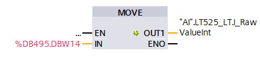
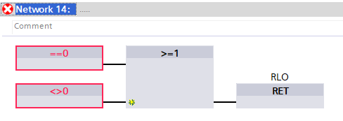

## Today's Tasks

1. Compilations Errors.
    1. [PIC420](https://github.com/pfAuto/project-uni/issues/37) ✅
    2. [MAX_INT](https://github.com/pfAuto/project-uni/issues/31) ✅
    3. [ALS Compare2RealArea](https://github.com/pfAuto/project-uni/issues/32) ✅
    4. [SEL_3_REAL_ENABLE](https://github.com/pfAuto/project-uni/issues/33) ✅
    5. [SEL_6_REAL_ENABLE](https://github.com/pfAuto/project-uni/issues/34) ✅
    6. [SEL_16_REAL_ENABLE](https://github.com/pfAuto/project-uni/issues/35) ✅
    7. [SimulationBlock](https://github.com/pfAuto/project-uni/issues/36) ✅
    8. [_STD_LogCopyToBuffer](https://github.com/pfAuto/project-uni/issues/27) ✅
    9. [RampPIC430](https://github.com/pfAuto/project-uni/issues/30) ✅
2. Compilation Warnings.
    1. [_STD_CMD_Phase](https://github.com/pfAuto/project-uni/issues/39)
   2. [_STD_PhaseID](https://github.com/pfAuto/project-uni/issues/40)
   3. [_STD_PhaseID_Transfer](https://github.com/pfAuto/project-uni/issues/41)
   4. [_STD_PhaseID_CIpCurcuit](https://github.com/pfAuto/project-uni/issues/42)
      <!-- truncate -->


## Compilation Errors

### PIC420

#### Method

Since updating "IBD PIC420" with technology block "instPIC420", to resolve this error replaced the use of "IDB PIC420"
with "instPIC420"

### MAX_INT

#### Method

1. Replace usage of MAX_INT with the built-in "MAX" function.
2. Deleted MAX_INT function from project

### ALS Compare2RealArea

#### Method

1.

```text
      L     #OffsetCmp2
      SLW   3
      L     #A2_AREA
      *I
      ITD
      L     #A2_StartAdr
      +D
      LAR2                       // Load Address register 2 from ACCU 1
      SET                        //<-- Added SET here to resolve TIA Migration Compilation error. AFL 101025
      R     #OUT                 // reset the result of the previous check
```

### SEL_3_REAL_ENABLE

#### Method

1. Network 1

```text
      SET                        // <-- Added to resolve compilation error. AFL 101025
      R     #ENO_1
      R     #ENO_2
      R     #ENO_3
      L     0.0
      T     #VALUE
```

### SEL_6_REAL_ENABLE

#### Method

1. Network 1

```text
      SET                        //<--Added to resolve compilation error. AFL 101025
      R     #ENO_1
      R     #ENO_2
      R     #ENO_3
      R     #ENO_4
      R     #ENO_5
      R     #ENO_6
      L     0.0
      T     #VALUE
```

### SEL_16_REAL_ENABLE

#### Method

1. Network 1

```text
      SET                        //<--Added to resolve compilation error. AFL 101025
      R     #ENO_1
      R     #ENO_2
      R     #ENO_3
      R     #ENO_4
      R     #ENO_5
      R     #ENO_6
      R     #ENO_7
      R     #ENO_8
      R     #ENO_9
      R     #ENO_10
      R     #ENO_11
      R     #ENO_12
      R     #ENO_13
      R     #ENO_14
      R     #ENO_15
      R     #ENO_16
      L     0.0
      T     #VALUE
```

### SimulationBlock

#### Method




1. Network 61
2. Deleted network 61 as LT525 does not exist.

### _STD_LogCopyToBuffer

#### Method
Commented out sections in network 2 and 6 as shown below.

Network 2

```text
// Commented out to resolve compilation error. afl 101025
//      L DINO                     //Get Instance-DB-number
//      T     #TMP_DIMemory        //Save Instance-DB-number
//      TAR2  #TMP_AR2Memory       //Save Content of AR2
//------------------------
```

Network 6

```text
   //------------------------
   // Commented out to resolve compilation error. afl 101025
   //      SET
   //      OPN DI [ #TMP_DIMemory]    //Restore Instance-DB-number
   //      LAR2  #TMP_AR2Memory       //Restore content of AR2.
   //-----------------------

```

Testing

:::danger Future Task
Need to test this block in testing phase of this project
:::

### RampPIC430

#### Method

1. 
2. Deleted network 14 as RLO of block is not passed on.

## Compilation Warnings

### _STD_CMD_Phase

:::info What F1 help says on this issue
The value of an output parameter is written to the actual parameter after the block code has been executed. Therefore,
the rule is that output parameters should not be read within the block. When reading, the value of the formal parameter
that is valid during processing is read instead of the value of the connected actual parameter. If you nevertheless read
an output parameter, note that it can be undefined or the initial value of the data type of the formal parameter.

The value of an input parameter is written to the formal parameter before the block code is executed. Therefore, the
rule is that input parameters should not be written within a block. When writing, the value of the format parameter
would be written and not the value of the interconnected actual parameter.

The value of an in/out parameter with a simple data type is read before the block call and written after the block call.
If you read or write the parameter within the block, you only access the formal parameter.

An exception is in/out parameters with a structured data type. Structured data types are data types that consist of
several data elements, for example ARRAY or STRUCT. These are transferred to the called block by a POINTER. You
therefore always access the actual parameter when you read or write a structured in/out parameter within a block.
:::

#### Method

After reading the lase paragraph of above `F1 Help` article;

1. Created a `command Struct` in the `InOut` interface of `_STD_CMD_Phase`.

As follows;
| Name        | Data type |
|-------------|:----------|
| command	    | Struct	   |		
| - Start	    | Bool	     |		
| - Reset	    | Bool	     |		
| - Hold 	    | Bool	     |		
| - Restart	  | Bool	     |		
| - Abort	    | Bool	     |		
| - Finalize	 | Bool	     |		
| - Stop	     | Bool	     |		
| - Acquire	  | Bool	     |		
| - GoStep	   | Bool	     |		

1. In a calling block, inserted the `command Struct` in the `Temp`
2. Updated this block call
3. Deleted original TMP_CMD_xxx variables 
4. Employed the `command Struct` at the `command` `InOut` parameter.
5. Re-compiled software (Rebuild All).

### _STD_PhaseID

#### Method

1. Created new function `_StdPhaseId` and replaced usage of `_STD_PhaseID` with it.
2. Deleted `_STD_PhaseID`
3. Compiled software (Rebuild All)


### _STD_PhaseID_Transfer

#### Method

1. Created new function `_StdPhaseIdTransfer` and replaced usage of `_STD_PhaseID_Transfer` with it.
2. Deleted `_STD_PhaseID_Transfer`
3. Compiled software (Rebuild All)


### _STD_PhaseID_CipCurcuit

#### Method

1. Created new function `_StdPhaseIdCipCircuit` and replaced usage of `_STD_PhaseID_CipCurcuit` with it.
2. Deleted `_STD_PhaseID_CipCircuit`
3. Compiled software (Rebuild All)

## What's Next

More [Compilation Warnings](https://github.com/pfAuto/project-uni/issues/38)