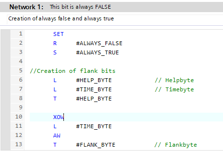
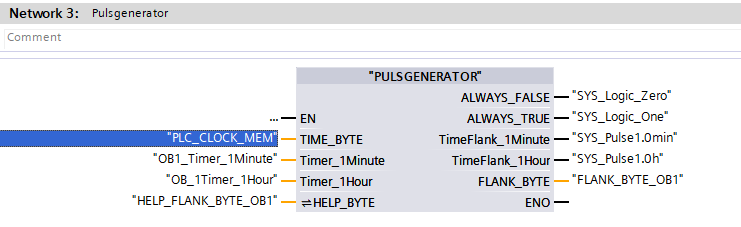

## Today's Tasks
1. Compilation Warnings
   1. [LT410 scaling](https://github.com/pfAuto/project-uni/issues/43)
   2. [OBJECT TIMER](https://github.com/pfAuto/project-uni/issues/44)
   3. [FaultTDAlsafe](https://github.com/pfAuto/project-uni/issues/65)
   4. [PULSGENERATOR](https://github.com/pfAuto/project-uni/issues/45)


<!-- truncate -->

## Compilation Warnings

### LT410 scaling

#### Method

An integer value was being written to an absolute address of a datablock memory area which consisted of consecutive
boolean variables.

To resolve the issue, employed `R` function to reset each bit individually.

:::info Question
Is there a more concise method of resetting consecutive bits which are not in an array?
:::

### OBJECT TIMER
 #### Warning

Network 1,The output parameter "OUT" might not be written.


#### Method
 Replaced the `BEC` operator with a `JC` to the `END` label
 
Original code
```text
     A     #START               //Start of timer
      JC    CNT
      L     0
      T     #MEMORY              //Reset MEMORY
      JU    END
CNT:  L     #MEMORY
      L     #TIME_VALUE
      >=I
      JC    END
      A     #F_PULSE             //FLANK PULSE
      L     #MEMORY
      JCN   END
      L     65535
      ==I                        //Check overflow
      SAVE
      BEC
      L     #MEMORY
      L     1                    //Count up
      +I
      T     #MEMORY
END:  A(
      L     #MEMORY
      L     #TIME_VALUE
      >=I
      )
      A     #START
      =     #OUT
```

updated to 

```text
     A     #START               //Start of timer
      JC    CNT
      L     0
      T     #MEMORY              //Reset MEMORY
      JU    END
CNT:  CLR
      L     #MEMORY
      L     #TIME_VALUE
      >=I
      JC    END
      A     #F_PULSE             //FLANK PULSE
      L     #MEMORY
      JCN   END
      L     65535
      ==I                        //Check overflow
      JC    END                  // <-- added to resolve compilation warning. afl 111025
      L     #MEMORY
      L     1                    //Count up
      +I
      T     #MEMORY
END:  CLR
      A(
      L     #MEMORY
      L     #TIME_VALUE
      >=I
      )
      A     #START
      =     #OUT
```
### FaultTDAlsafe

#### The Problem

Block Interface - Temp


Network 4


#### The Fix

Block Interface - Temp


Network 4


### PULSGENERATOR

#### The Problem(s)

Block Interface Input variables were being written too.
Block Interface Output variables were being read.

#### The Fix

1. Created a `rw` Struct in the block interface InOut area, 
2. moved the problematic variables into the new Struct
3. updated the variable references in the code networks. 
4. In `MAIN_PRG` pasted `rw` struct into the block interface Temp area. 
5. Updated the `PULSGENERATOR` block call
6. Updated the rw parameter to reference the `MAIN_PRG`  Temp `rw` variable
7. Compiled software(Rebuild All)

Before fix


MAIN_PRG


After fix



MAIN_PRG

