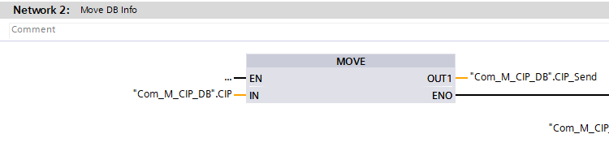
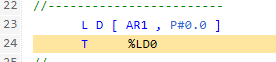

## Today's Tasks
1. Compilation Warnings
    1. [ALS RecipeCopy](https://github.com/pfAuto/project-uni/issues/46)
    2. [RECIPE COPY](https://github.com/pfAuto/project-uni/issues/47)
    3. [SBL WordToBits](https://github.com/pfAuto/project-uni/issues/48)
    4. [SELECTION_16](https://github.com/pfAuto/project-uni/issues/49)
   5. [INTEGER TO S5TIME](https://github.com/pfAuto/project-uni/issues/50)
   6. [TREND_PENS_2](https://github.com/pfAuto/project-uni/issues/51)
   7. [Com_M_Alcip_FC](https://github.com/pfAuto/project-uni/issues/53)
   8. [COMPLETE_RESTART](https://github.com/pfAuto/project-uni/issues/54)
   9. [_STD_CondEvaluation](https://github.com/pfAuto/project-uni/issues/55)
<!-- truncate -->

## Compilation Warnings

### ALS RecipeCopy
#### Investigation

In network 3 both the source and destination recipe numbers are compared with the `#START_RECIPE`
```text
// pseudo code
if sourceRecipeNumber < startRecipeNumber
 || destinationRecipe < startRecipeNumber:
    // by-pass write to `#"ALS RecipeCopy"` ,jump to `END` and set `#error`
```

#### The Fix

At beginning of the function, added;
```text
    L     0                    //<-- Added to resolve compilation warning. afl 121025
    T     #"ALS RecipeCopy"    //<-- Added to resolve compilation warning. afl 121025
```

### RECIPE_COPY

#### Investigation

Similar findings as above with ALS RecipeCopy.

In network 1 both the source and destination recipe numbers are compared with `1`
```text
// pseudo code
if sourceRecipeNumber < startRecipeNumber
 || destinationRecipe < startRecipeNumber:
    // by-pass write to `#RecipeCopy` ,jump to `END` and set `#error`
```


#### The Fix

In network 1 added the following;

```text
 1    L     0                    //<-- added to resolved migration compilation warning. afl 121025
 2    T     #RECIPE_COPY         //<-- added to resolved migration compilation warning. afl 121025
```

### SBL_WordToBits

#### The Fix
Cut the `IN_WORD` parameter from the blocks `Input` interface and pasted in the blocks `InOut` interface.

### SELECTION_16


#### The Fix
In network 1 added the following;

```text
 1    L     0                    //<-- added to resolved migration compilation warning. afl 121025
 2    T     #VALUE         //<-- added to resolved migration compilation warning. afl 121025
```

### INTEGER TO S5TIME

#### Investigation

TIA Portal provides the `T_CONV` function which perform the INT to S5TIME conversion. 

#### The Fix

Therefore, deleted "INTEGER TO TIME" and replaced usage with `T_CONV`. Example shown below;


### TREND_PENS_2

#### Investigation

TREND_PENS_2 called in `GeneralHMI`

#### The Fix

Moved parameters `PEN_x` , where x is 1 to 6 inclusive, from the `Input` interface to the `InOut` interface. 


### COM_M_Alcip_FC

#### Investigation


Found the addresses were both occupied by the same UDT which is 16-bits wide

#### The Fix

Therefore, updated with the symbolic tags. As shown below.



### COMPLETE_RESTART

#### Investigation

Danfoss drives are not used in this project.

#### The Fix

Deleted Network 1


### _STD_CondEvaluation

#### Investigation




## What's Next

Investigating writing a new function in SCL and estimating work load.