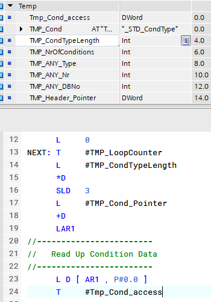

## Today's Tasks
:::info
Directly below are links to project issues. **Use the sidebar for in-blog navigation --->**
:::
1. Compilation Warnings
    1. [_STD_UnitAllocation](https://github.com/pfAuto/project-uni/issues/58)
    2. [SBL PhaseCommand](https://github.com/pfAuto/project-uni/issues/59)
    3. [SBL Selection 2xPB](https://github.com/pfAuto/project-uni/issues/61)
    4. [XFerInlet2](https://github.com/pfAuto/project-uni/issues/60)
    5. [_STD_CM_Valve](https://github.com/pfAuto/project-uni/issues/62)
    6. [_STD_CondEvaluation](https://github.com/pfAuto/project-uni/issues/55)
    7. [_STD_RecipeDownload](https://github.com/pfAuto/project-uni/issues/63)
    8. [_USR_Count01](https://github.com/pfAuto/project-uni/issues/64)
    9. [_STD_CM_AI](https://github.com/pfAuto/project-uni/issues/66)
    10. [_STD_CM_DI](https://github.com/pfAuto/project-uni/issues/67)
<!-- truncate -->

## Compilation Warnings

### _STD_UnitAllocation

#### The Fix

Moved `Batch` , `Local` and `UI` from the block interface `Output` area to the `InOut` area.

### SBL PhaseCommand

#### The Fix

### SBL Selection 2xPB

#### The Fix

### XFerInlet2

#### Investigation
This block is not called.

#### The Fix
Copied this FB and it's instDB to the project library MasterCopies > deleted folder and deleted them from the program blocks

### _STD_CM_Valve

#### Investigation

#### The Fix

Created a new UDT, which provided symbols for the memory areas requiring symbolic access, where elementary data type
were not appropriate.

Updated the block `Temp` interface as follows;

### _STD_CondEvaluation

#### The Fix

### _STD_RecipeDownload

#### Investigation

#### The Fix

Created new UDT `_stdRecipeDataAccess` and employed AT function

Updated code block

### _USR_Count01

#### Investigation

#### The Fix

Also, created new UDT, _usrCountStatAccess and updated reference to %LD10.

### _STD_CM_AI

#### Investigation

Absolute address access employed for three UDT's, _STD_AI_Ctrl, _STD_AI_Par and _STD_AI_Stat.

Word0 of _STD_AI_Ctrl requires symbolic access, UDT has mix types, therefore requires new UDT for access

Word0 of _STD_AI_Par requires symbolic access, UDT has mix types, therefore requires new UDT for access

DWord0 of _STD_AI_Stat requires symbolic access, UDT has mix types, therefore requires new UDT for access

#### The Fix

Created new UDT's 
- _stdAiCtrlAccess
- _stdAiParAccess
- _stdAiStatAccess

Replace usage of absolute address with the appropriate symbolic addresses.

### _STD_CM_DI

#### Investigation

Absolute address access employed for three UDT's, _STD_DI_Ctrl, _STD_DI_Par and _STD_DI_Stat.

Word0 of _STD_DI_Ctrl requires symbolic access, UDT word 0 is all bool, can there added variable of type word

Word0 of _STD_DI_Par requires symbolic access, UDT has mix types, therefore requires new UDT for access

DWord0 of _STD_DI_Stat requires symbolic access, UDT DWord 0 is all bool, can there added variable of type DWord

#### The Fix

Created new UDT's
- _stdDiParAccess

Replace usage of absolute address with the appropriate symbolic address.
